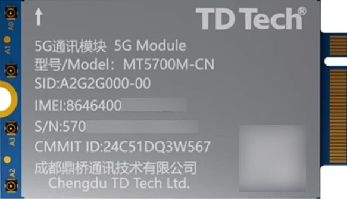
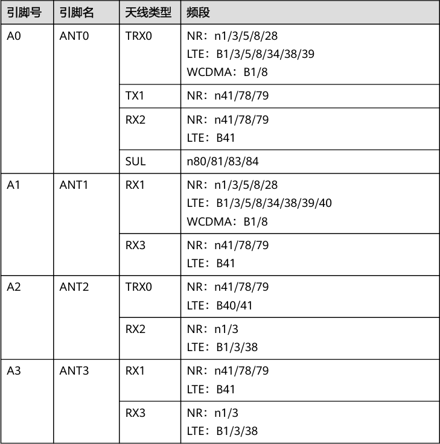
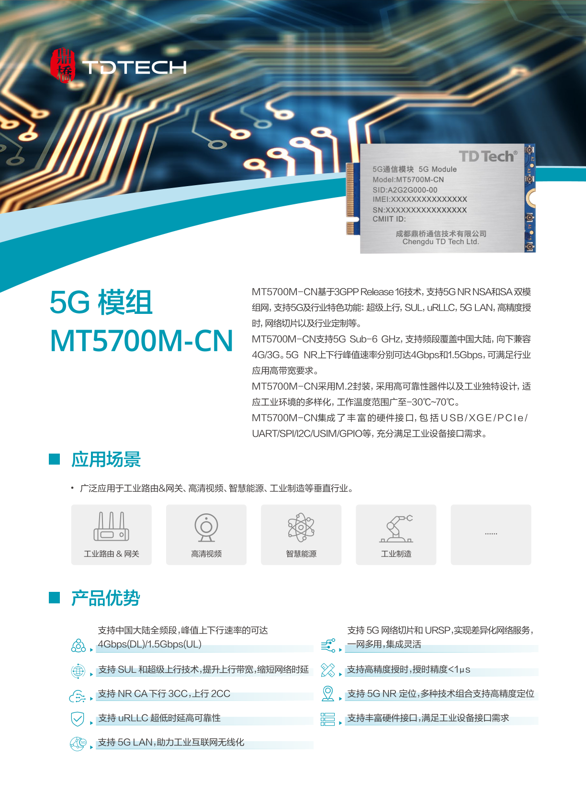
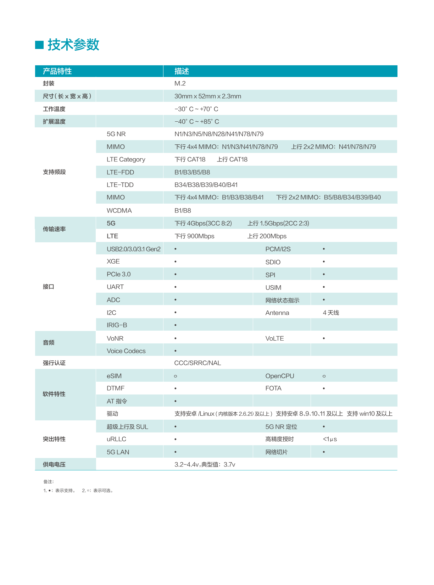

# 📚 Table of Contents
- [📚 Table of Contents](#-table-of-contents)
- [📡 MT5700M-CN](#-mt5700m-cn)
  - [🔌 Connection Methods](#-connection-methods)
    - [🔗 USB Modes](#-usb-modes)
    - [💻 PCIe Mode](#-pcie-mode)
  - [Tutorials](#tutorials)
    - [How to get Internet acccess with Windows](#how-to-get-internet-acccess-with-windows)
      - [Setup](#setup)
      - [Dial up](#dial-up)
    - [How to recover modem IMEI](#how-to-recover-modem-imei)
    - [How to update/degrade firmware](#how-to-updatedegrade-firmware)
  - [🔗 Related Resources](#-related-resources)
  - [📡 Antenna Definition](#-antenna-definition)
  - [📋 Specification](#-specification)

# 📡 MT5700M-CN


The MT5700M-CN supports 5G NR NSA and SA dual-mode networking, along with 5G and industry-specific features such as 3CC carrier aggregation, Super Uplink (SUL), uRLLC, 5G LAN, and more. It supports 5G Sub-6 GHz with frequency band coverage for **China** mainly and is backward compatible with 4G/3G. The peak downlink and uplink rates of 5G NR reach up to 4 Gbps and 1.5 Gbps⚡

## 🔌 Connection Methods

The MT5700M-CN module features an external interface in the form of an **M.2 Key-B interface**.

### 🔗 USB Modes

It only supports application scenarios as a **USB DEVICE**. A DEVICE does not have the ability to initiate communication actively and must wait for instructions from the HOST. It is recognized by the HOST through a hardware connection and handshake process, and during the enumeration process, it provides descriptor information (such as device ID, vendor ID, function description, etc.) to allow the HOST to understand its capabilities and complete the configuration.

When used as a *DEVICE*, there are a total of 9 USB port configuration modes, which can be switched using the command `AT^SETMODE=<mode>`.

|Mode|Description|
|-|-|
|0|🐧 Linux ECM Normal, `ECM+DIAG+PCUI+Serial_B+Serial_C+GPS`|
|1|🪟 Windows NCM Normal, `DIAG+PCUI+Serial_B+Serial_C+GPS+NCM`|
|2|🐧 Linux ECM Debug, `ECM+DIAG+PCUI+ADB+Serial_B+Serial_C+GPS`|
|3|🪟 Windows NCM Debug, `DIAG+PCUI+Serial_B+Serial_C+GPS+ADB+NCM`|
|4|🐧 Linux NCM Normal(Default), `NCM+DIAG+PCUI+Serial_B+Serial_+GPS`|
|5|🐧 Linux NCM Debug, `NCM+DIAG+PCUI+ADB+Serial_B+Serial_C+GPS`|
|6|🪟 Windows RNDIS, `RNDIS+DIAG+PCUI+Serial_B+Serial_C+GPS`|
|7|🪟 Windows MBIM (Not Supported Yet), `MBIM+DIAG+PCUI+Serial_B+Serial_C+GPS`|
|8|📞 PPP, `Modem+DIAG+PCUI+Serial_B+Serial_C+GPS`|

Key available ports:
- 🖥️ **PCUI**: Used for AT command communication
- 📊 **Serial_B/C**: Used in conjunction with DIAG for log collection
- 🔍 **DIAG**: Used for debugging and collecting log information
- 🛠️ **ADB**: ~~Available only in debug modes~~ Not Supported Yet

### 💻 PCIe Mode

The module supports PCIe RC (Root Complex) mode **ONLY**. In this mode, the modem will act as the host, providing network support for other endpoint devices like an Ethernet chipset or a WiFi chipset.

- Using `AT^TDPCIELANCFG=2` sets PHY chip to `RTL8125` (2.5Gbps ⚡)  
- Default `AT^TDPCIELANCFG=1` uses `RTL8111` (1Gbps 🔌)

## Tutorials
### How to get Internet acccess with Windows
This section heavily depends on `AT User Manuals`, if you have any questions with the commands, you may look up the manual, which is available in *Materials* section
#### Setup
You only need to send the commands **once** as they are saved even power is off.
1. Set PHY to support 2.5Gbps: `AT^TDPCIELANCFG=2`
2. Enable PCIE Power Manager: `AT^TDPMCFG=1,0,0,0`
3. Set auto dial and send in USB connection mode: `AT^SETAUTODIAL=1,2`
#### Dial up
You have to send the command **everytime** you want to get access to the internet: `AT^NDISDUP=1,1`

### How to recover modem IMEI
Send command `AT^PHYNUM=IMEI,[Original IMEI]` to change it.  
You may use command like `ATI` to check if this works.  
```⚠️ Cautious: Remember to backup your current IMEI before changing it```

### How to update/degrade firmware
Firmware can be updated easily on Windows platform.  
You can download update wizards provided below to flash a **specific** version of firmware.

## 🔗 Related Resources
- [MT5700M PHY AT ETH Control](https://github.com/Coming-2022/mt5700m_at_control) 
- [luci-app-modem with support](https://github.com/Siriling/openwrt-app-actions/tree/c3c47cb0aeb4652bcc6f27e76ec1be8b5f74edec/applications/luci-app-modem)
- [TD-Tech MT5700 PPT](./images/other/TD-Tech%205G%20MT5700%20Series%20202303.pptx)
- [MT5700 Related Documents](https://drive.google.com/drive/folders/1AWR5jJWn9jiKCCSJt4vxaNVYaPxkPEUu?usp=sharing)
- [Windows Driver](https://mega.nz/folder/uioW2CLK#c9fkeUznVEJknlmvVdemBg)
- [Firmware update wizard](https://mega.nz/folder/m6xUTYhJ#NNa0ybZhL3m31rZXbDQrgg)

## 📡 Antenna Definition


## 📋 Specification

